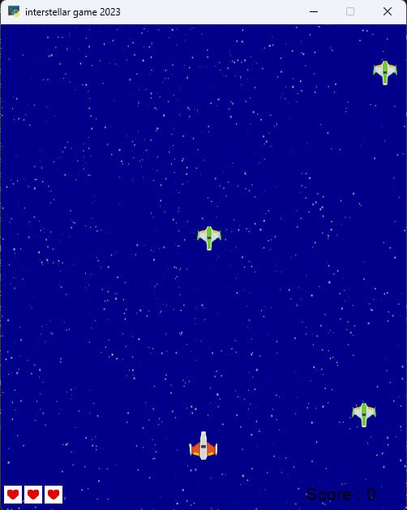
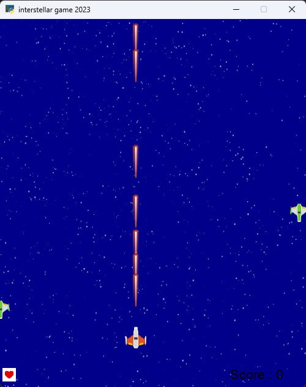

# Interstellar Game

This game is programmed by Python language using the **[arcade](https://api.arcade.academy/en/latest/index.html)** library.

You may move your spaceship by the arrows to the right and left and also you can fire with the SPACE botton.

You can see your score on the bottom right of the screen.

---
## The Rules
It's so simple, you have 3 hearts and if one invader crosses to your home planet, you lose one heart.

Also if you hit an invader, your spaceship will explodes and it's game over.

---

### ScreenShots of the Game

